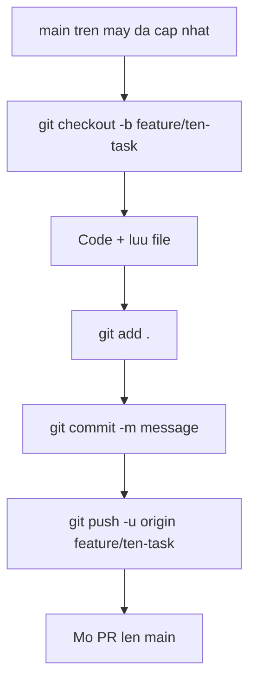

# Git cơ bản cho người mới

Tài liệu này giúp làm quen với vài lệnh Git hay dùng và **một luồng làm việc** từ lúc tạo nhánh đến lúc đẩy code lên remote (GitHub/GitLab).

> Mở **Terminal** (macOS/Linux) hoặc **Git Bash / PowerShell** (Windows). Các lệnh dưới đây chạy trong thư mục project (repo) của bạn.

---

## 1. Một số khái niệm nhanh

| Thuật ngữ | Ý nghĩa đơn giản |
|-----------|------------------|
| **Repository (repo)** | Thư mục project đã được Git theo dõi (có thư mục ẩn `.git`). |
| **Remote** | Bản copy trên server (thường là GitHub) — tên mặc định hay gặp: `origin`. |
| **Branch (nhánh)** | Một “đường” phát triển riêng, không làm hỏng nhánh chính (`main` hoặc `master`) khi đang thử nghiệm. |
| **Commit** | Một “ảnh chụp” thay đổi kèm ghi chú; mỗi lần commit là một điểm lưu trong lịch sử. |

---

## 2. Các lệnh hay dùng (giải thích ngắn)

### `git branch`

- Xem nhánh đang đứng: `git branch` (nhánh có dấu `*` là nhánh hiện tại).
- Tạo nhánh mới (vẫn đang ở nhánh cũ): `git branch ten-nhanh-moi`
- Thường dùng kết hợp với `git checkout` hoặc `git switch` (xem dưới).

### `git checkout` / `git switch`

- Chuyển sang nhánh khác: `git checkout ten-nhanh` hoặc `git switch ten-nhanh`
- Tạo nhánh mới **và** chuyển sang luôn: `git checkout -b ten-nhanh-moi` hoặc `git switch -c ten-nhanh-moi`

### `git fetch`

- Lấy thông tin mới từ remote (có nhánh mới, commit mới…) **nhưng không** gộp vào code trên máy bạn.
- Ví dụ: `git fetch origin`
- Sau `fetch`, thường kết hợp merge hoặc pull (xem `git pull`).

### `git pull`

- Tải thay đổi từ remote **và** gộp vào nhánh hiện tại (tương đương fetch + merge trong nhiều trường hợp).
- Ví dụ đang ở nhánh `main`: `git pull origin main`
- **Nên pull trước khi làm việc** để tránh xung đột với code mới của team.

### `git add`

- Đưa file vào vùng “chuẩn bị commit” (staging).
- `git add ten-file.ts` — chỉ một file.
- `git add .` — mọi thay đổi trong thư mục hiện tại và thư mục con (cẩn thận: đừng add nhầm file nhạy cảm như `.env.local`).

### `git commit -m "ghi chú"`

- Tạo commit với message mô tả thay đổi.
- Ví dụ: `git commit -m "fix: sửa lỗi nút đăng xuất"`
- Chỉ commit được **sau khi** đã `git add` các file cần thiết.

### `git push`

- Đẩy commit trên máy bạn lên remote.
- Lần đầu đẩy nhánh mới: `git push -u origin ten-nhanh` (sau đó có thể chỉ cần `git push`).

---

## 3. Flow: từ tạo nhánh đến push code

Làm **theo thứ tự** dưới đây khi bắt đầu một task mới (feature / fix).

### Bước 0 — Vào đúng thư mục project

```bash
cd duong-dan/toi/finrecruit-app
```

### Bước 1 — Cập nhật nhánh chính từ remote

```bash
git checkout main
git pull origin main
```

(Nếu nhánh chính của team là `master`, thay `main` bằng `master`.)

### Bước 2 — Tạo nhánh mới và chuyển sang nhánh đó

```bash
git checkout -b feature/ten-task-ngan-gon
```

Ví dụ: `feature/add-login-button`, `fix/waiting-room-typo`.

### Bước 3 — Code, rồi kiểm tra thay đổi

```bash
git status
```

`git status` cho biết file nào sửa, file nào chưa add.

### Bước 4 — Chọn file đưa vào commit

```bash
git add .
```

Hoặc chọn từng file: `git add src/app/...`

**Lưu ý:** không commit file chứa mật khẩu, key (`.env.local`). Nếu cần, thêm vào `.gitignore`.

### Bước 5 — Commit

```bash
git commit -m "feat: mô tả ngắn gọn bằng tiếng Việt hoặc tiếng Anh"
```

### Bước 6 — Đẩy nhánh lên remote (lần đầu)

```bash
git push -u origin feature/ten-task-ngan-gon
```

Lần sau chỉ cần:

```bash
git push
```

### Bước 7 — (Tuỳ team) Tạo Pull Request / Merge Request

Trên GitHub/GitLab: mở PR từ nhánh `feature/...` vào `main`, nhờ review rồi merge.

---

## 4. Sơ đồ luồng (tóm tắt)



---

## 5. Khi làm việc lâu trên nhánh — đồng bộ với `main`

Trước khi push hoặc khi `main` trên remote có commit mới:

```bash
git fetch origin
git checkout main
git pull origin main
git checkout feature/ten-nhanh-cua-ban
git merge main
```

(Giải quyết conflict nếu có — hỏi anh chị hướng dẫn lần đầu.)

---

## 6. Lỗi thường gặp

| Triệu chứng | Gợi ý |
|-------------|--------|
| `nothing to commit` | Chưa sửa file, hoặc chưa `git add`, hoặc đã commit hết. |
| `failed to push` | Remote có commit mới: `git pull` (hoặc merge/rebase) rồi push lại. |
| Nhầm nhánh | `git branch` xem nhánh hiện tại; `git checkout ten-nhanh-dung` để chuyển. |

---

## 7. Tham khảo thêm

- [Git official docs](https://git-scm.com/doc) (tiếng Anh)
- [GIT_NAMING.md](./GIT_NAMING.md) — quy ước đặt tên **nhánh** và **commit** (`feature/`, `fix/`, `feat:`, …)
- Trong team: thống nhất theo tài liệu naming và quy ước message commit.

Chúc các bạn làm quen Git từ từ — lệnh ít nhưng dùng đúng lúc là đủ cho hầu hết công việc hàng ngày.
